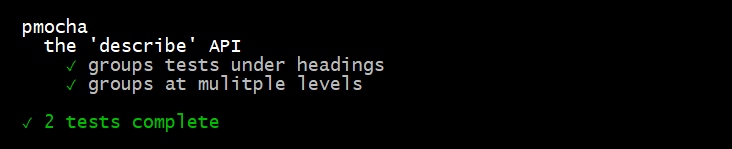

pmocha
======

A lightweight perl knock off of the [mocha][1] javascript test framework.


Test scripts follow the [mocha][1] describe/it pattern to declare the test 
intention foreach test:

```
decribe("An object", sub {

	it("must do something", sub {
		expect(1+1, 2);
	});

});
```

And the command line is used to execute test scripts and report the results:

```
$ pmocha test.mpl
```




Setup
-----

Requires perl to be installed and in the $PATH.

1. Clone the repository:

   ```
   $ git clone http://github.com/fiveladdercon/pmocha
   ```

2. Set the **$PMOCHA** environment variable to the pmocha repository:

   ```
   $ export PMOCHA=/path/to/local/pmocha
   ```

3. Define a **pmocha** alias:

   ```
   $ alias pmocha='perl -I $PMOCHA -MPMocha -e "PMocha::run()" --'
   ```

If using bash, the environment variable and alias can be set using the
setup file:

```
$ cd /path/to/pmocha
$ source setup
```

Once set up, a demo test script can be run like this:

```
$ cd $PMOCHA
$ pmocha
```


Command Line Interface
----------------------

```
$ pmocha [TEST_SCRIPT [TEST_SCRIPT ...]]
```

The pmocha comman line runs one or more test scripts that are passed on the
command line.  If no test scripts are listed, all files with the .mpl extension 
are run.

Note that the pmocha test structure & assertion API is present in the main 
namespace so test scripts have access to the test API without any imports. 


Test Structure API
------------------

#### decribe(text, callback)

The **describe** function is used to group tests under the **text** header,
and provide further structuring with it's **callback** argument.  The 
**callback** can further **describe** other test groups or declare tests 
with **it**.

#### it(text, callback)

The **it** function declares the intention of the test with it's **text**
argument, and provides the implementation of the test with it's **callback**
argument.

#### xdescribe(text, callback)

This skips all tests in the described group.

#### xit(text, callback)

This skips the test instead of running it.


Assertion API
-------------

These functions are intended to be called in **it** callbacks.

#### fail(format, ...)

Fails a test, reporting the provided message.  The **format** and optional
**args** are fed to `sprintf`.

#### assert(result, [format, ...])

Fails a test if the **result** is not truthy.

#### expect(actual, expected)

Fails a test if the **actual** value is not equal to the **expected** value.
Only scalar arguments are supported.

#### diff(actual, expected)

Writes the **actual** and **expected** values to actual and expected files
for diffing. The intent is to help identify differences between the values
when they are long, multi-line strings.


[1]: https://mochajs.org/
